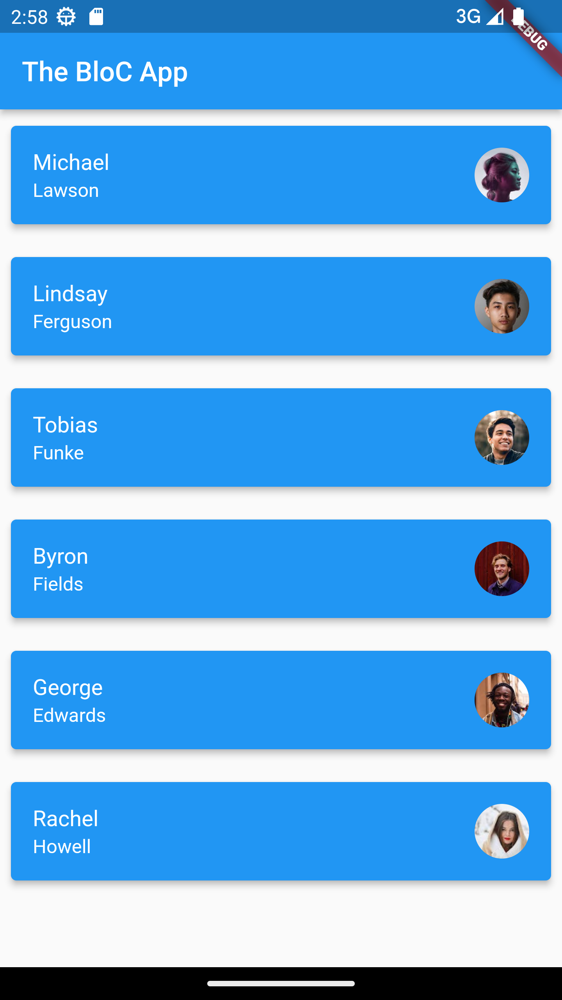

<h2>Flutter BLoC Http Get Example | Fetch API Data | Flutter BLoC Pattern Rest Api Call</h1>

<h3>Source code for the video from dbestech channel on Youtube</h2>

<h4>Video description from dbestech channel: </h4> 

<i>Learn about flutter BLoC pattern 8 fetching data from api or call api using http get request. We covered what is bloc pattern, what are states and events and how to build blocs using them. We also covered how to create states and events using classes and connect them by building blocs. 

We talked about how user interaction creates events and that leads to state changes. flutter bloc pattern rest api call.

We also showed how to work for Restful Api with RepositoryProvider.</i>

<h4>Resources for this Flutter project:</h4>

- [Video link youtube](https://www.youtube.com/watch?v=CjCTNPKhgXc)
- [Youtube dbestech channel](https://www.youtube.com/@dbestech)

<h4>Screenshots for the project</h4>

<!--  -->

    

        <h4>List screen</h4> 
         
    

    

        <h4>Detail screen</h4> 
         
    

